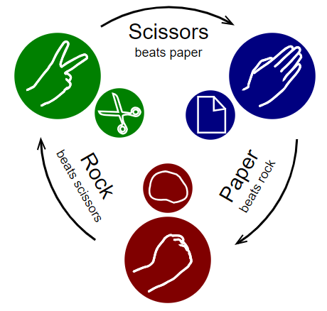

# Rock-Paper-Scissors

Paper-Rock-Scissors game application between the computer and a real player.

The winner is determined by the following schema:  
* Paper beats (wraps) rock  
* Rock beats (blunts) scissors  
* Scissors beats (cuts) paper

## How to Play

Real player can select below moves (case-insensitive):
* STONE
* PAPER
* SCISSORS

After real player move current round ends:

    Select move [ROCK, PAPER, SCISSORS] or q/Q to quit: paper
    HumanUser made move PAPER [WIN] <==> Computer made move ROCK [LOST]

To quit game `q` or `Q` can be entered and statistics of players will be printed:

    Select move [ROCK, PAPER, SCISSORS] or q/Q to quit: q
    Overall statistics and game score is:
     HumanUser: Win 1, Lost 0, Tie 0 --> Result WIN
      Computer: Win 0, Lost 1, Tie 0 --> Result LOST

